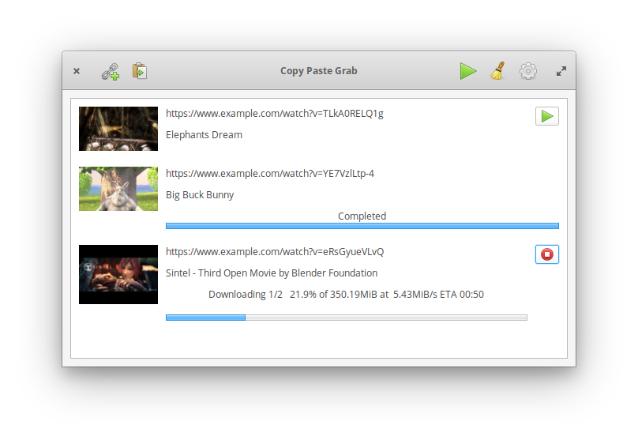

# Copy Paste Grab

[](https://travis-ci.com/cryptowyrm/copypastegrab)

[](https://appcenter.elementary.io/com.github.cryptowyrm.copypastegrab)

An [elementary OS](https://elementary.io/) app written in [Vala](https://wiki.gnome.org/Projects/Vala) that provides a GUI frontend for the popular [youtube-dl](https://github.com/rg3/youtube-dl/) command line application to easily download videos from [hundreds of websites](https://rg3.github.io/youtube-dl/supportedsites.html).



## How to hack on the code

**These instructions are for elementary OS 5 Juno.**

You need to install youtube-dl or download it manually and put it on your PATH:

```
sudo apt install youtube-dl
```

Also make sure you have the elementary-sdk installed:

```
sudo apt install elementary-sdk
```

Then do:

```
git clone https://github.com/cryptowyrm/copypastegrab.git
cd copypastegrab
meson build --prefix=/usr
cd build
ninja
```

After following the above steps, just execute `ninja` in the build directory whenever you make changes to recompile, then start the app with `./com.github.cryptowyrm.copypastegrab` or do a `sudo ninja install` and use the app launcher to start the app.
